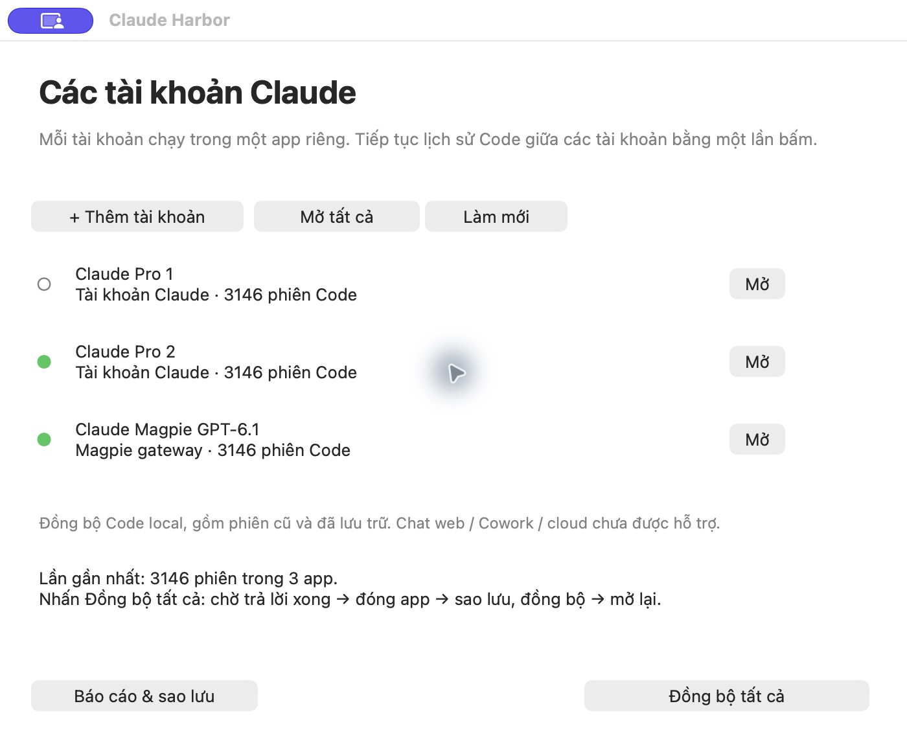

# Claude Harbor

**Nhiều tài khoản Claude. Một nơi để mở app và đồng bộ phiên Code local.**

Claude Harbor là app macOS nhỏ giúp tạo nhiều bản Claude Desktop thật, đăng nhập riêng từng tài khoản và tiếp tục lịch sử Code giữa chúng bằng một nút.

[Tải v0.1.0](https://github.com/anlvdt/claude-harbor/releases/tag/v0.1.0) · [English](README.md)

## Cách dùng

1. Cài Claude Desktop chính thức tại `/Applications/Claude.app`. Cần macOS 14+, Apple Silicon và Apple Command Line Tools (`xcode-select --install`).
2. Tải ZIP từ Releases, giải nén rồi đặt **Claude Harbor.app** trong Applications.
3. Bấm **+ Thêm tài khoản**, đặt tên rồi đăng nhập trong bản Claude mới.
4. Mở tab **Code**, tạo một phiên **Local**, quay lại Harbor bấm **Làm mới**.
5. Khi có ít nhất hai profile sẵn sàng, bấm **Đồng bộ tất cả**. App chờ trả lời xong, đóng nhẹ các bản Claude, sao lưu và đồng bộ, rồi mở lại.

**Mở / Mở tất cả** để chạy các tài khoản đồng thời. Menu **C≋** trên thanh menu giúp mở nhanh và đồng bộ. **Báo cáo & sao lưu** mở thư mục báo cáo và bản sao lưu.

Bản đầu tiên ký ad-hoc, chưa được Apple notarize; macOS có thể yêu cầu bạn cho phép mở app tải về. Giao diện hiện bằng tiếng Việt.

## Đã hỗ trợ

- Mỗi bản Claude có dữ liệu đăng nhập riêng.
- Đồng bộ transcript và đăng ký phiên để hiện trong sidebar Code.
- Nhập lịch sử local cũ/đã lưu trữ có nội dung đọc được.
- Giữ nhiều nhánh nếu hội thoại được tiếp tục khác nhau giữa các tài khoản.
- Sao lưu và phục hồi giao dịch khi ghi lỗi.
- Profile chưa đăng nhập / chưa mở Code được báo chờ; các profile khác vẫn đồng bộ.

Đã đối chiếu thực tế **3.146 nhóm phiên ở ba profile**, không thiếu bản sao và không khác nội dung hội thoại trong phạm vi đã đồng bộ.

## Giới hạn

Chỉ đồng bộ **Code local trên cùng máy**. Chưa hỗ trợ Chat web, Cowork, cloud hoặc nhiều máy; không khôi phục transcript đã xóa hay trên ổ chưa kết nối. Cần đóng các bản Claude trong lúc ghi đồng bộ. Chưa có cơ chế cập nhật đồng loạt các clone khi Claude chính thức đổi phiên bản.

Preset Magpie là cấu hình gateway local đã kiểm chứng, chưa phải trình cấu hình API/model bất kỳ. Model cụ thể phụ thuộc routing của Magpie.

[Chi tiết cài đặt, build và dữ liệu](README.md) · [Cách đồng bộ](docs/session-sync.md).

Mã nguồn MIT. Đây là công cụ cộng đồng độc lập, không phải sản phẩm chính thức của Anthropic.
