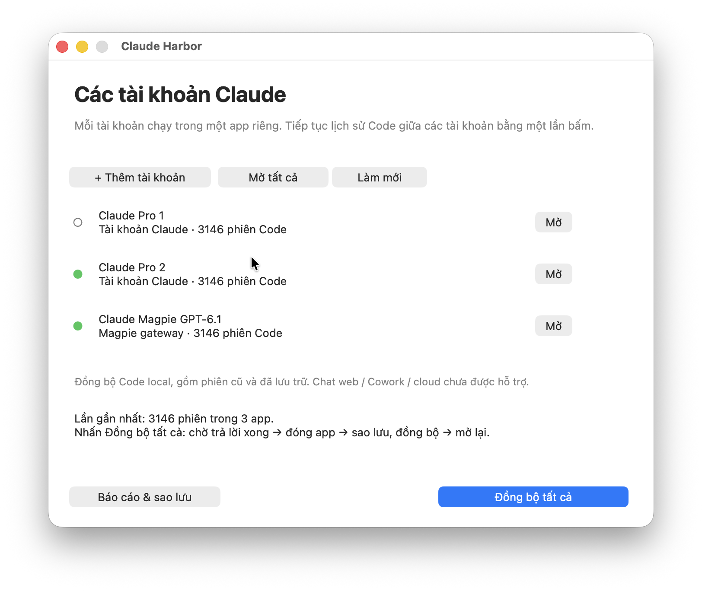

# Facebook launch kit

- `facebook-post.md`: bài tiếng Việt, copy nội dung để đăng lên Facebook.
- `facebook-poster.png`: poster giới thiệu mới, dùng làm ảnh chính khi đăng Facebook.
- `facebook-real-screenshot.png`: screenshot native thật do chủ repo cung cấp, giữ nguyên ảnh; dùng làm ảnh thứ hai sau poster.
- `facebook-screenshot.png`: ảnh chụp cửa sổ quản lý trước đó, giữ lại để tham khảo.
- `../docs/screenshots/claude-harbor-add-profile.png`: ảnh thao tác thêm tài khoản, có thể đính kèm làm ảnh thứ hai.

Các ảnh chỉ hiển thị tên profile chung và số lượng phiên. Không có email, token, tên dự án hay nội dung hội thoại. Bài viết được chuẩn bị để chủ repo tự đăng, không tự động đăng lên Facebook.

Poster là hình minh họa quảng bá, không phải screenshot giao diện. Tạo bằng công cụ imagegen tích hợp; prompt trong `IMAGE_PROMPT.md`.

## Screenshot giao diện thật

Gợi ý đăng Facebook: ảnh 1 là `facebook-poster.png`, ảnh 2 là `facebook-real-screenshot.png`. Screenshot được sao chép nguyên bản, không dựng lại bằng AI.
